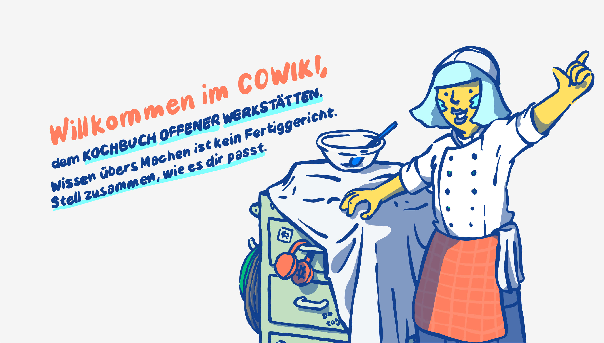

# cowiki



## Introduction

This repository is the main project for cowiki, developed by the
Verbund-Offener-Werkstaetten. We welcome and invite everyone to contribute to
this open-source project by helping with coding and reporting issues.

The tech stack for vow-cowiki is based on PHP Laravel for the backend and Vue3
for the frontend.

## Set-Up

To get started with contributing to vow-cowiki, follow these steps:

1. Make sure you have Visual Studio Code installed, as it is the recommended
   code editor for this project.
2. The development environment is based on Docker. Clone the repository using
   the following command:

```
git clone git@github.com:Verbund-Offener-Werkstaetten/vow-cowiki.git
```

3. Create a useful .env file for the Laravel project by running:

```
cp laravel/.env.example laravel/.env
```

Afterwards you have to add the correct database credentials to the `.env` file:

- `DB_HOST=database`
- `DB_DATABASE=cowiki`
- `DB_USERNAME=cowiki`
- `DB_PASSWORD=` is stored in the `docker-compose.yml` and can be copied

4. Build the development containers using Docker Compose:

```
docker-compose build
```

5. Once the build is complete, start the project with:

```
docker-compose up -d
```

6. For convenience, we provide a Visual Studio Code Workspace file at
   `.vscode/vow-cowiki.code-workspace`.

### Seeding Initial Data

To seed the initial data into the database, follow these steps:

1. Log onto the Laravel Docker container:

```
docker exec -it cowiki.laravel /bin/bash
```

2. Run all migrations:

```
art migrate
```

3. Seed fake data into the database:

```
art db:seed
```

### Local Authentication

If you want to test the Application offline (without having valid
willkommen.offene-werkstaetten.org credentials), you can activate a local
jwt-authentication.

in vue/.env you have to set `VITE_KEYCLOAK_ENABLED=false`

in laravel/.env youhave to make sure that:

- `KEYCLOAK_REALM_PUBLIC_KEY=null` ( set keycloak realm public key to null)
- `JWT_SECRET=yourfreakysecret` (set a JWT-Secret, you can use
  `php artisan jwt:secret` to generate one)
- `API_AUTH_DRIVER=jwt` API_AUTH_DRIVER is set to jwt
- `API_AUTH_PROVIDER=users` API_AUTH_PROVIDER is set to users

You will now have a /auth/register Page available, where you can add and register new
users. The Application will then work with the newly registered users (locally
from your database, no SSO via Keycloak needed).

## Code-Style

To maintain a consistent code style across the project, we use the following
tools and extensions:

### PHP-CS-Fixer

To install PHP-CS-Fixer, run the following command within
`laravel/tools/php-cs-fixer`:

```
composer install
```

To manually trigger a fix run:

```
cd vow-cowiki/laravel
tools/php-cs-fixer/vendor/bin/php-cs-fixer fix ./
```

### Prettier

For JavaScript and Vue files, we rely on "Prettier". Install the VS Code
Extension `esbenp.prettier-vscode` to ensure proper code formatting.

### EditorConfig

We also use an `.editorconfig` file to handle code style settings for other file
types. Make sure to install the corresponding EditorConfig extension for your
code editor.

## Xdebug for PHP Debugging

To enable XDebug for PHP debugging, follow these steps:

1. Set `XDEBUG=true` in the `laravel/.env` file.
2. Restart the Docker containers to apply the changes.

You can now use the `vow-cowiki Xdebug` debug-preset inside Visual Studio Code
to start debugging.

## Testing

All test files are located in `laravel/tests` and can be run using the following
command:

```
art test
```

## Using the API for cowiki.de

you can find a Open-API-Specification at https://cowiki.de/docs/. You will be
able to authenticate and communicate with the API Endpoint under cowiki.de The
API-Specification is generated using (Scribe)[https://scribe.knuckles.wtf/]. If
you want to edit the Specification, please write an issue in this repository and
add the label "documentation".
